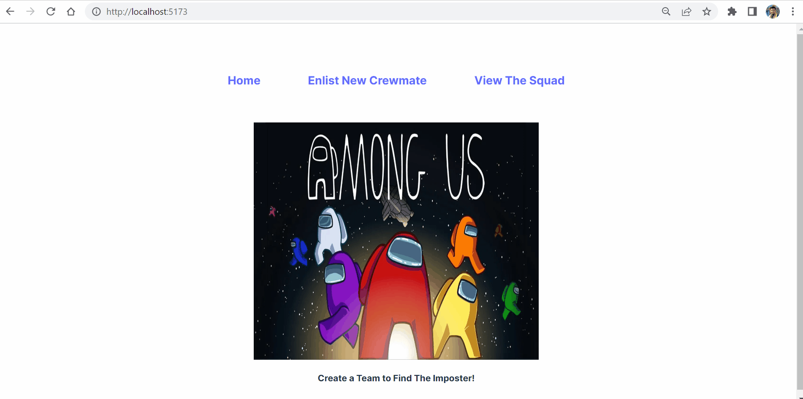

# CrewmateMaker

Submitted by: Johnny A. Cortez

A simple Among Us styled team creator

Time spent: 6 hours

# Required Features

A create form allows users to add new crewmates - completed

Users can name the crewmate - completed

Users can set the crewmate’s attributes by clicking on one of several values - completed

The site displays a summary page of all the user’s added crewmates - completed

A previously created crewmate can be updated from the crewmate list - completed

A previously created crewmate can be deleted from the crewmate list - completed

Each crewmate has a direct, unique link to an info page about them - completed

## Video Walkthrough

Here's a walkthrough of implemented features:

GIF created with ScreenToGif

## Notes

## License

    Copyright [2023] [Johnny A. Cortez]

    Licensed under the Apache License, Version 2.0 (the "License");
    you may not use this file except in compliance with the License.
    You may obtain a copy of the License at

        http://www.apache.org/licenses/LICENSE-2.0

    Unless required by applicable law or agreed to in writing, software
    distributed under the License is distributed on an "AS IS" BASIS,
    WITHOUT WARRANTIES OR CONDITIONS OF ANY KIND, either express or implied.
    See the License for the specific language governing permissions and
    limitations under the License.
